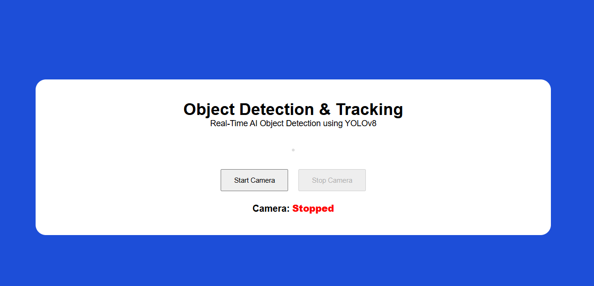
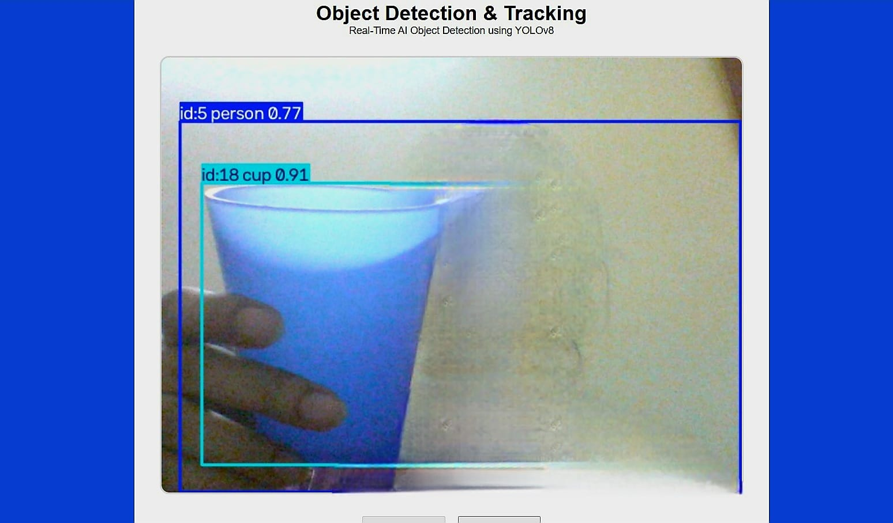

# 🎯Object Detection and Tracking

A real-time AI-powered Object Detection and Tracking web application built using **Python**, **Flask**, **OpenCV**, **YOLOv8**, and **ByteTrack**. The application captures live video from a webcam, detects multiple objects in real time, assigns unique tracking IDs, and displays the processed video directly in the browser.

This project was developed as **Task 4** of the **CodeAlpha Artificial Intelligence Internship**.

---

## ✨ Features

- 🎥 Real-time webcam streaming
- 🤖 YOLOv8 object detection
- 📦 Real-time object tracking with ByteTrack
- 🏷️ Bounding boxes with object labels
- 🔢 Persistent tracking IDs
- 🌐 Browser-based interface using Flask
- ▶️ Start and Stop camera controls
- 🔔 Toast notifications for user actions
- 📱 Responsive and clean user interface

---

## 🛠️ Technologies Used

- Python 3.14
- Flask
- OpenCV
- Ultralytics YOLOv8
- ByteTrack
- HTML5
- CSS3
- JavaScript

---

## 📂 Project Structure

```text
CodeAlpha_ObjectDetectionTracking/
│
├── app.py
├── detector.py
├── requirements.txt
├── README.md
├── LICENSE
├── .gitignore
│
├── models/
│
├── static/
│   ├── css/
│   │   └── style.css
│   └── js/
│       └── script.js
│
├── templates/
│   └── index.html
│
└── screenshots/
```

---

## ⚙️ Installation

### 1. Clone the repository

```bash
git clone https://github.com/Aamnah-Basharat/CodeAlpha_ObjectDetectionAndTracking.git
```

### 2. Navigate to the project folder

```bash
cd CodeAlpha_ObjectDetectionAndTracking
```

### 3. Create a virtual environment

```bash
python -m venv venv
```

### 4. Activate the virtual environment

**Windows**

```bash
venv\Scripts\activate
```

### 5. Install dependencies

```bash
pip install -r requirements.txt
```

### 6. Run the application

```bash
python app.py
```

### 7. Open in your browser

```
http://127.0.0.1:5000
```

---

## 📸 Screenshots

### Home Page



### Real-Time Object Detection



---

## 📖 How It Works

1. The Flask server starts the web application.
2. OpenCV captures frames from the webcam.
3. YOLOv8 detects objects in each frame.
4. ByteTrack assigns persistent IDs to detected objects.
5. The processed frames are streamed back to the browser in real time.

---

## 👩‍💻 Author

**Aamnah Basharat**

BS Artificial Intelligence Student

GitHub: https://github.com/Aamnah-Basharat

---

## 📄 License

This project is licensed under the MIT License.
